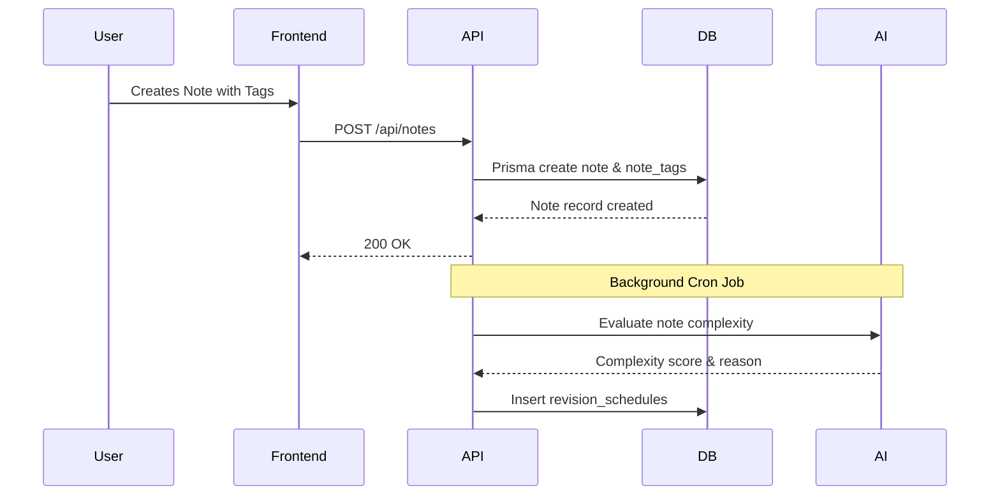
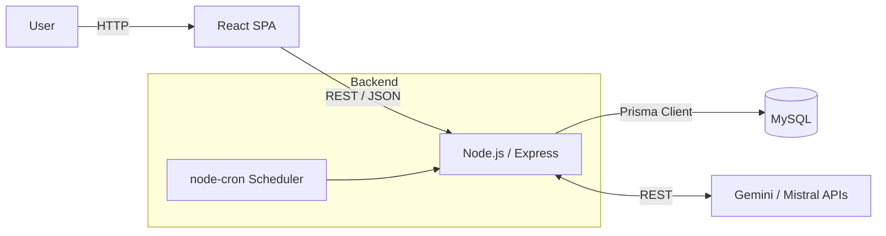
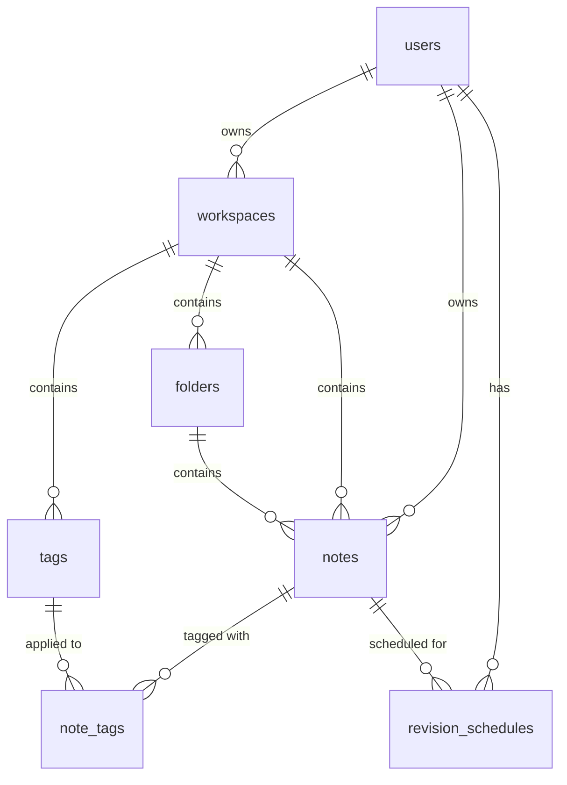

# Project Overview

The project is a connected note-taking application called **NoteGraph**. It organizes notes into workspaces and folders, tags them, and visualizes relationships using an interactive knowledge graph. 

It solves the problem of information silos found in traditional hierarchical note-taking apps by combining folder structures with cross-cutting tags and visual knowledge graphs. 

It is designed for students, researchers, and knowledge workers who need both structured organization and connected insights. The primary value proposition lies in its graph visualization and the integration of AI-driven revision scheduling.

Its apparent current stage is an advanced academic or portfolio project (identified as an "OOPS Project" in the README), though it implements complex features like JWT authentication, Three.js 3D visualization, and AI API integrations.

## 1. Executive Summary

NoteGraph provides a rich-text editing environment where users can structure knowledge hierarchically (via workspaces and folders) and networked (via tags). The main workflow involves a user creating a workspace, adding notes, tagging them, and exploring their connections in a graph view. Additionally, an AI-powered background scheduler evaluates notes and schedules them for revision.

The architecture is a modern full-stack JavaScript monolith. Despite the `README.md` claiming a Java Spring Boot backend, the actual implementation uses a Node.js/Express backend with Prisma ORM querying a MySQL database. The frontend is a React Single Page Application (SPA) built with Vite and Three.js.

The most important engineering decisions include pivoting to a Node.js stack (likely for better integration with AI SDKs like Mistral and Gemini) and implementing background revision scheduling using in-process `node-cron` rather than a dedicated message queue. 

Current strengths include a well-normalized relational database schema and clear module boundaries in the Express controllers and routes. The most important limitations are the significant documentation drift (the README is entirely outdated regarding the backend stack), the lack of automated tests, and the scalability constraints of running background jobs in the main API process.

## 2. Problem Statement

The underlying problem NoteGraph solves is the difficulty of discovering relationships between disparate pieces of information. Traditional hierarchical note-taking systems (like standard file systems) force a single categorization, which restricts lateral thinking. 

This matters because knowledge workers and students often need to synthesize information across multiple topics. Without NoteGraph, users might solve this by using multiple applications concurrently—for instance, a standard note app alongside a separate mind-mapping tool. 

NoteGraph removes this friction by automatically generating a graph based on tags and folder structures, and by proactively scheduling note revisions using AI. 

*Assumptions:* The preparation assumes the target audience values graph-based visual discovery over pure text search. 

## 3. Target Users and Use Cases

- **Primary users:** Students and researchers managing complex study materials.
- **Secondary users:** Developers and knowledge workers maintaining personal wikis.
- **Main use cases:** 
  - Creating and organizing rich-text notes.
  - Categorizing knowledge using a dual system (hierarchical folders + relational tags).
  - Visualizing knowledge connections via a 3D graph.
- **Less obvious use cases:** AI-assisted spaced repetition (inferred from `revision_schedules` and `node-cron` jobs).

## 4. Core User Journey

1. **User Login:** The user authenticates via the frontend. The API validates credentials and returns a JWT.
2. **Workspace Selection:** The user selects a workspace, loading the scoped folders, tags, and notes.
3. **Note Creation:** The user writes a note in the rich-text editor and assigns it to a folder and multiple tags.
4. **Data Persistence:** The React client sends a `POST /api/notes` request. The Express backend uses Prisma to create the note and its tag relations in MySQL.
5. **Graph Visualization:** The user navigates to the Knowledge Graph page. The frontend fetches graph data and renders a Three.js interactive visualization.
6. **AI Evaluation (Background):** A `node-cron` job occasionally processes new notes, evaluates their complexity via an AI SDK (Mistral/Gemini), and writes a `revision_schedules` record to the database.

## 5. Feature Breakdown

- **Workspaces & Folders (Fully implemented):** Isolates data and provides a strict hierarchy. Implemented via relational foreign keys in MySQL. 
- **Tags (Fully implemented):** Provides lateral connections across folders. Implemented via the `note_tags` join table.
- **Rich Text Editor (Fully implemented):** Client-side editor for content formatting. 
- **Knowledge Graph (Fully implemented):** Uses `three` (Three.js) on the frontend to visualize `notes`, `tags`, and `folders`. 
- **AI Revision Scheduler (Partially implemented/Experimental):** Uses `node-cron` in the Node backend to process notes through `@google/genai` or `@mistralai/mistralai` for automated spaced repetition scheduling.

## 6. Technology Stack

| Layer | Technology | Where It Is Used | Why It Fits | Trade-Offs |
|---|---|---|---|---|
| Frontend | React 19 + Vite | UI and SPA routing | Modern, fast HMR, excellent component ecosystem. | None significant for this scale. |
| Visualization | Three.js | Knowledge Graph page | High-performance 3D rendering. | Steeper learning curve and higher client bundle size. |
| Backend | Node.js + Express | API layer | Native JSON handling, great for async AI network calls. | Single-threaded nature can block if JSON payloads are huge. |
| ORM | Prisma | Database access | Type-safe, excellent schema migration system. | Abstraction can sometimes hide inefficient SQL queries (N+1). |
| Database | MySQL 8.0 | Data persistence | Strong relational integrity for workspaces/notes. | Requires rigid schema migrations compared to NoSQL. |
| Background | node-cron | Scheduled tasks | Simple setup without extra infrastructure. | Does not scale to multiple API instances; state is lost on restart. |
| AI | Gemini / Mistral | Note evaluation | Powerful LLM reasoning capabilities. | Latency and reliance on third-party uptime. |

## 7. High-Level Architecture

The system follows a standard Client-Server monolith architecture with a relational database and external API dependencies. 

## 8. Module and Folder Map

| Path | Responsibility | Important Notes |
|---|---|---|
| `Frontend/src/pages/` | Top-level React views | Contains Editor, KnowledgeGraph, RevisionPage. |
| `NodeBackend/src/routes/` | Express route definitions | Maps HTTP methods to controller logic. |
| `NodeBackend/src/controllers/` | Request handling & business logic | E.g., `ai.routes.js`, `note.routes.js`. |
| `NodeBackend/prisma/` | Database schema & migrations | `schema.prisma` is the source of truth for the data model. |
| `NodeBackend/src/jobs/` | Background tasks | Contains `revisionScheduler.js`. |

## 9. Data Model

The data model relies on strong relational boundaries, primarily scoped by `workspace_id` and `owner_id`. 

- **Entities:** `users`, `workspaces`, `folders`, `notes`, `tags`, `revision_schedules`, `activity_logs`.
- **Relationships:** A workspace contains folders, tags, and notes. Notes have a many-to-many relationship with tags via `note_tags`. Revisions are tied to a specific note and user.
- **Important state transitions:** Notes have statuses (`DRAFT`, `IN_REVIEW`, `COMPLETED`), and revisions have statuses (`PENDING`, `SENT`, `SKIPPED`, `COMPLETED`).

## 10. API and Interface Design

The backend exposes a standard REST API via Express. 
- **Major endpoints:** `/api/auth`, `/api/notes`, `/api/workspaces`, `/api/tags`, `/api/graph`, `/api/revisions`, `/api/ai`.
- **Authentication:** Likely JWT Bearer tokens passed in the `Authorization` header.
- **Input validation:** Middleware-based (implied by the Express architecture). 
- **Payloads:** Express is configured to accept massive JSON payloads up to `50mb` (`app.use(express.json({ limit: '50mb' }))`), indicating the system expects very large rich-text documents or base64 images.

## 11. Authentication and Authorization

- **Identity:** Established via email and password (using `bcryptjs`).
- **Sessions:** Stateless JWTs (`jsonwebtoken`) are issued on login.
- **Permissions:** The schema tracks `owner_id` on notes and workspaces. The API likely checks if the authenticated JWT subject matches the `owner_id` of the requested resource.
- **Limitations:** If JWTs are stored in `localStorage`, they are vulnerable to XSS.

## 12. Important Engineering Decisions

**Decision:** Pivoting from Java/Spring Boot to Node.js/Express.
- **Evidence:** The `README.md` explicitly describes a Spring Boot app, but the codebase (`NodeBackend/`, `package.json`, `index.js`) is entirely Node.js and Prisma.
- **Likely Reason:** The developer likely pivoted to JavaScript/TypeScript to take advantage of Prisma's developer experience or to unify the tech stack (JS/React on frontend, JS/Express on backend), and simply forgot to update the README. 
- **Trade-off:** Node.js simplifies JSON parsing and AI API integrations, but the documentation drift creates massive technical debt for onboarding.

**Decision:** Using `node-cron` for background jobs.
- **Evidence:** `package.json` includes `node-cron`, initialized in `index.js` via `jobs/revisionScheduler`.
- **Likely Reason:** Extremely simple to implement without requiring external infrastructure like Redis.
- **Cost:** Stateful in-memory cron jobs mean the backend cannot be horizontally scaled. If two instances of the API run, the cron job fires twice, potentially causing duplicate AI API calls or database writes.

**Decision:** 50MB JSON Payload Limit.
- **Evidence:** `app.use(express.json({ limit: '50mb' }));` in `index.js`.
- **Likely Reason:** Rich text editors often embed images as base64 strings directly in the HTML/JSON payload.
- **Cost:** High risk of DoS attacks or Node.js memory exhaustion if a user uploads multiple 50MB payloads simultaneously.

## 13. Reliability and Failure Handling

- **Likely failure points:** External AI APIs (Mistral/Gemini) timing out or returning 500s. The `node-cron` thread throwing an uncaught exception.
- **Missing safeguards:** The in-process cron job lacks a retry mechanism (like BullMQ provides). If the Node server restarts, pending in-memory task state is lost. If an AI call fails, it's unclear if the scheduler gracefully recovers.

## 14. Performance and Scalability

- **Expensive workflows:** Generating the graph dataset (`/api/graph`) requires querying and assembling all notes, tags, and folder relationships for a workspace. 
- **Database query risks:** Potential N+1 queries if Prisma's `include` is not carefully used when fetching notes and their associated tags.
- **Horizontal scaling constraints:** The `node-cron` implementation completely blocks horizontal scaling of the API servers.

## 15. Security and Privacy Review

- **Payload limits:** The 50MB JSON payload limit is exceptionally high and represents a significant DoS risk. 
- **Authentication:** Standard JWT/bcrypt implementation. 
- **Authorization gaps:** Care must be taken in the controllers to ensure users cannot pass arbitrary `workspace_id`s in their payloads to insert notes into other users' workspaces.

## 16. Testing and Quality Strategy

- **Existing test types:** None. 
- **Evidence:** The `package.json` test script reads `"echo \"Error: no test specified\" && exit 1"`. There are no visible test directories.
- **Missing cases:** The logic that evaluates note complexity and schedules revisions is complex and highly business-critical; it urgently requires unit tests.

## 17. Deployment and Operations

- **Local development:** Uses Vite (`npm run dev`) and Nodemon (`nodemon ./src/index.js`).
- **Containers & CI/CD:** No Dockerfiles, Docker Compose, or GitHub Actions workflows are present.
- **Database migrations:** Handled via Prisma (`prisma migrate`).

## 18. Current Strengths

- **Practical framework choice:** The React + Node.js + Prisma stack is highly productive for solo developers.
- **Thoughtful schema design:** The database schema is cleanly normalized, with clear ownership boundaries and dedicated tables for features like activity logging and revision scheduling.
- **Rich feature set:** Incorporating 3D graph visualization (Three.js) alongside standard CRUD and AI functionalities demonstrates broad full-stack capabilities.

## 19. Current Limitations and Technical Debt

1. **Critical:** Severe documentation drift. The README completely misrepresents the backend architecture (claiming Java/Spring instead of Node.js/Express). 
2. **High:** Zero automated tests. 
3. **High:** In-process background processing (`node-cron`) prevents horizontal scaling and risks silently dropping tasks on server restart.
4. **Medium:** Hardcoded 50MB payload limits present a performance and security vulnerability.

## 20. Production Readiness Gap

To move to production, the project needs:
- **Deployment automation:** Dockerization of the frontend and backend.
- **Reliability:** Migration of `node-cron` to a robust message queue like Redis + BullMQ to handle AI API rate limits, retries, and horizontal scaling.
- **Testing:** A Jest/Vitest suite for backend controllers and services.
- **Storage:** Transition from base64 embedded images (implied by the 50mb limit) to an external object store like AWS S3 with presigned URLs.

## 21. Improvement Roadmap

- **Immediate (Next 1–2 Weeks):** Fix the README to accurately reflect the Node.js architecture. Add basic unit tests for the core CRUD routes. Lower the JSON payload limit.
- **Near Term (Next 1–2 Months):** Extract the `node-cron` scheduler into a background worker using BullMQ and Redis. Implement S3 uploads for editor attachments.
- **Medium Term (Next 3–6 Months):** Dockerize the application, set up a CI/CD pipeline, and implement robust pagination for the graph API to handle workspaces with thousands of notes.

## 22. Metrics That Should Be Tracked

- **Product metrics:** Notes created per day, tag usage density (to see if the graph feature provides value).
- **Performance metrics:** Latency of the `/api/graph` endpoint (as note volume grows).
- **AI quality metrics:** API success/failure rates for Gemini/Mistral calls, latency of the revision scheduler.

## 23. Key Project Stories for Interviews

- **The Architecture Pivot:** Explaining the transition from a planned Java/Spring backend to Node.js/Express, and the trade-offs regarding developer velocity vs. statically typed safety.
- **Building the Knowledge Graph:** Discussing the challenges of transforming relational SQL data into a graph format suitable for Three.js rendering on the frontend.
- **Handling AI Asynchronously:** Exploring the initial implementation of the AI revision scheduler using `node-cron`, the limitations discovered, and the planned architectural evolution to a dedicated message queue.

## 24. Facts, Inferences, and Assumptions

### Verified from the Repository
- The backend is written in Node.js/Express using Prisma ORM.
- The frontend is a React application built with Vite and Three.js.
- The database is MySQL.
- AI integration is present for both Google Gemini and Mistral APIs.
- Background tasks are handled via `node-cron`.

### Strongly Inferred
- The README was written for a previous iteration of the project and was never updated after a major backend rewrite.
- The 50MB JSON limit exists because users are copy-pasting images directly into the rich text editor, converting them to base64 strings.

### Assumptions Requiring Confirmation
- The AI scheduling logic is assumed to process note text to determine complexity and next revision dates.
- The graph view is assumed to utilize Three.js for a 3D visual representation, rather than just standard 2D DOM elements.
